# Scailable 101 Getting Started
> Last updated 12-05-2020; By the Scailable core team.

This extensive tutorial provides the absolute starting point to start using [Scailable](https://www.scailable.net). We will take you through, *step-by-step*, the process of setting up your Scailable *beta* account (as currently we are in private beta), and the building of your first model. We will share all the steps as elaborately as possible, including the data we used to get to our end-goal: [a nice little web application that allows you to predict your yearly income](https://www.scailable.net/demo/salary). Admittedly, the predictions are pretty inaccurate, but the whole thing does go to show how easy it is to use [Scailable](https://www.scailable.net) to put *any* machine learning model in production. View it as a challenge to improve upon our model and deploy your improved version!

To start using Scailable we will cover the following steps:

1. [Signing up for the scailable beta](#signup). This should be easy, but we will show it anyway.
2. [After approval: a first look around](#look-around). A brief tour of our web admin.
3. [Installing the `sclblpy` package](#installing-sclblpy). In this "101" we focus on the use of the `sclblpy` `python` package to deploy models directly from python. So, we need to install the package.
4. [Fitting a model](#model-fitting). Technically model building itself is not really part of Scailable, but we will show how we build a simple salary prediction model and we will share the [jupyter notebook](https://github.com/scailable/sclbl-tutorials/blob/master/sclbl-101-getting-started/sclbl-tutorial.ipynb) we used to create the model. 
5. [Deploying the model using Scailable](#model-deployment). So, this is really just one line of code, but we will explain what happens behind the scenes.
6. [A simple web app](#app). Finally, once a model is deployed, you might want to use it; we give a very simple UI that allows you to interactively generates inferences from our `xgboost` salary model.

That's it; let's get started.

> **NOTE:** For those not wishing to read all the stuff below, the summary is pretty easy. If you wish to use [Scailable](https://www.scailable.net) to deploy a machine learning model, once you have an account, you only need a single line of code:
`sp.upload(fitted_model, feature_vector, docs=documentation)`.

<a name="signup"></a>
# 1. Signing up

To use [Scailable](https://www.scailable.net) you will need a scailable **beta** account; you get one at [https://admin.sclbl.net](https://admin.sclbl.net) which looks like this:

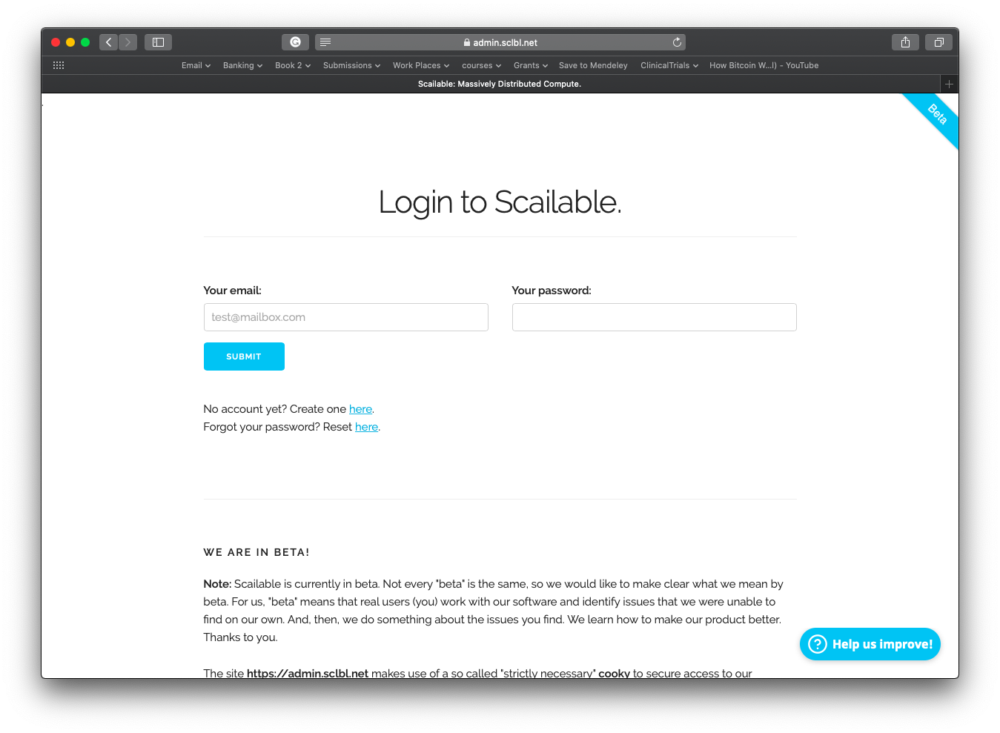

Admittedly, this is actually the page where you would *log in* if you have an account already. So, click on "here" in the sentence *"No account yet? Create one here."* Doing so gets you to [https://admin.sclbl.net/signup.html](https://admin.sclbl.net/signup.html) which looks like this:


On this page you simply fill in your name, email, and a password, and press the big blue **SIGN UP** button. This subsequently gets you to the following screen:

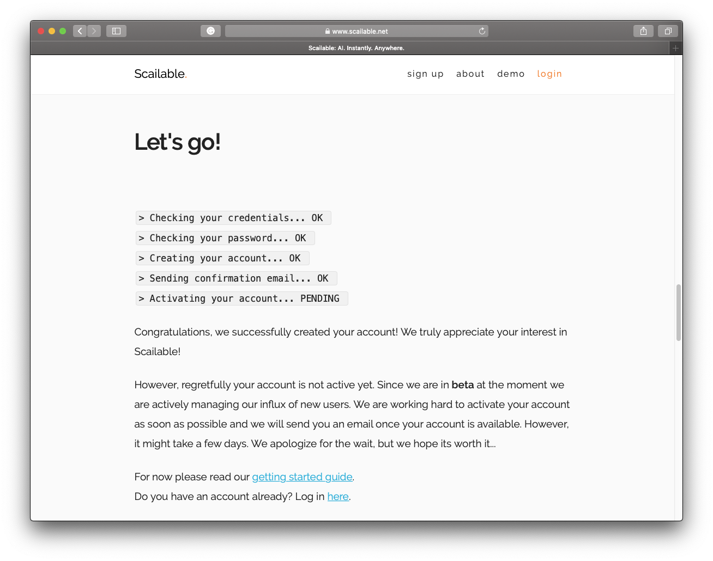

And next, [you wait....](https://www.youtube.com/watch?v=x_iPvUWyzhE)

While you are waiting we will check your application and we will *potentially* allow you into our **beta** program. Once we do, you receive the following email:

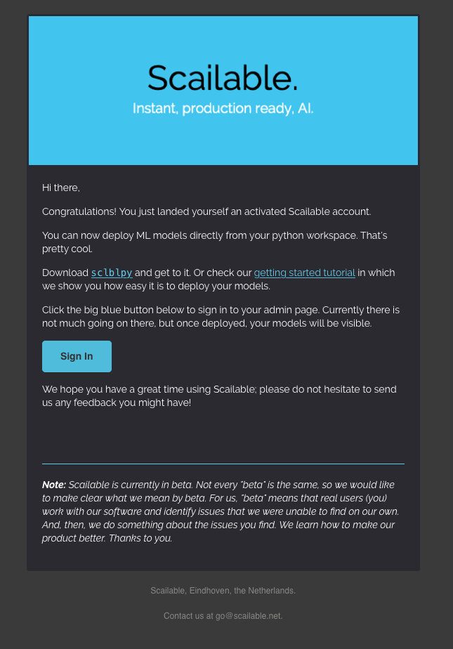

And you are good to go!

> **NOTE:** Please do note the "Help us improve" button at the bottom of every page; please do let us know if you have any questions, suggestions, praise, or complaints.

<a name="look-around"></a>
# 2. Looking around

After receiving your confirmation email, the next step should be relatively straightforward; you click the massive blue button in the email (and by doing so fully activate your account), and you arrive once again at our login page. By now you have a valid login, so go ahead!

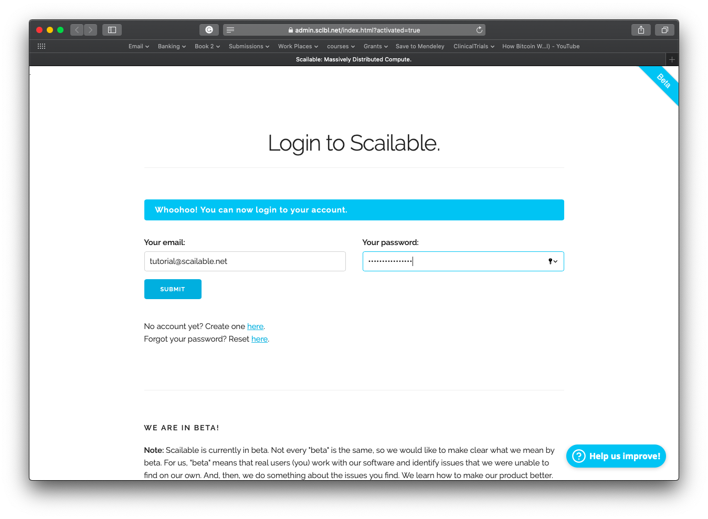

> **NOTE:** In the remainder of this section we effectively explain the Scailable admin interface; you can [skip this](#installing-sclblpy) if you wish.

## Endpoints
After logging in for the first time, you will find yourself at [https://admin.sclbl.net/endpoints.html](https://admin.sclbl.net/endpoints.html) which looks like this:

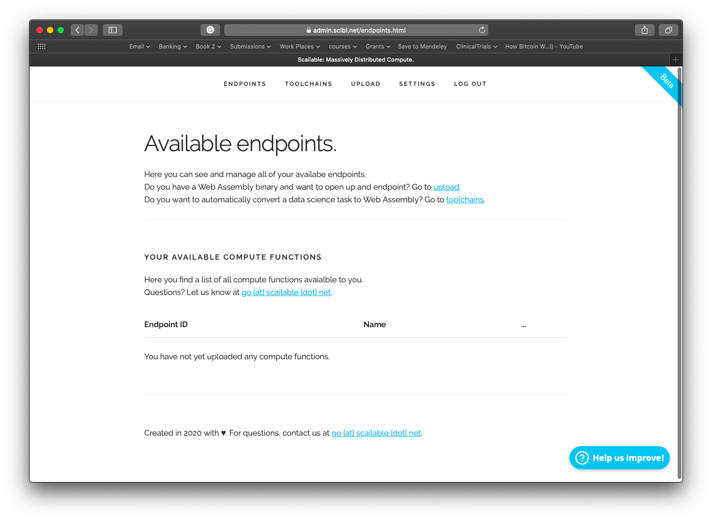

Admittedly, this page is somewhat uninteresting at this point, but that's because you currently do not own any endpoints. However, this might be a good time to explain what an endpoint actually is: A scailable *endpoint* is an easily accessible REST API endpoint which allows you to generate inferences form a machine learning model by simply providing a specific *feature vector* as *input*. The endpoint returns the resulting inference as *output* in JSON format. Thus, effectively, Scailable *endpoints* provide an extremely easy way of deploying ML and AI models.

At [https://admin.sclbl.net/endpoints.html](https://admin.sclbl.net/endpoints.html) you will, after creating an endpoint, be able to see and administer your created endpoints. We will show you how to create endpoints [in a minute](#model-deployment), but first we will continue our tour of the Scailable web admin.

## Toolchains
The next page is [https://admin.sclbl.net/toolchains.html](https://admin.sclbl.net/toolchains.html). This documentation page simply explains how you can use our `[R]` and `python` packages to convert fitted machine learning models directly to a deployment-ready Scailable REST endpoint using a "single-line-of-code". Which is pretty cool. The page itself looks like this:

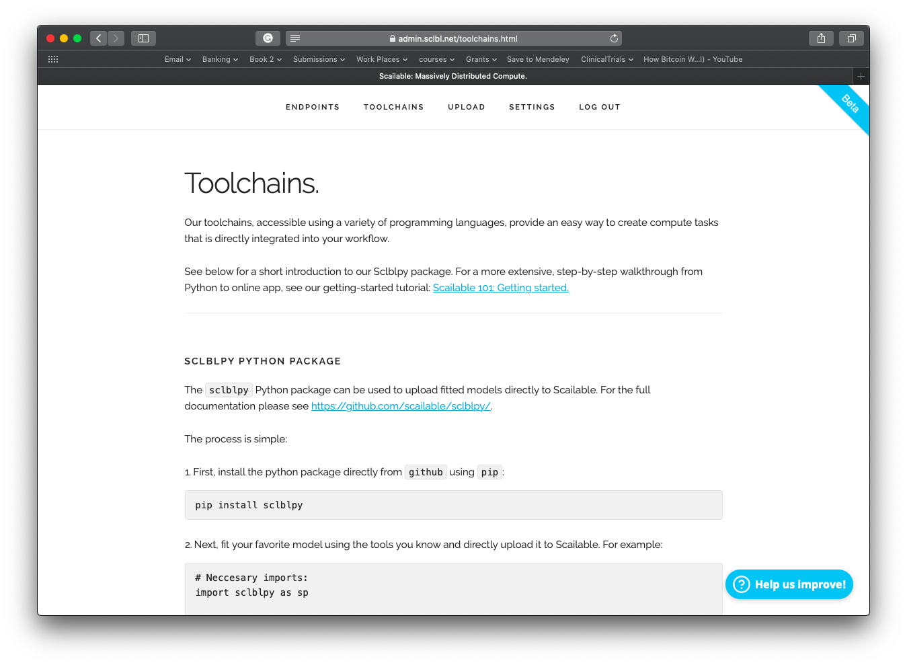

## Upload
The Upload page, found at [https://admin.sclbl.net/upload.hmtl](https://admin.sclbl.net/upload.html), is a bit more interesting: at this page you can upload your AI and machine learning tasks and convert them to a REST endpoint *manually*. By manually we mean that you would not use our `[R]` or `python` packages to upload a model, but rather you will create a machine learning or AI task in [WebAssembly](#wasm) yourself, *by hand*. Once you have such an optimized WebAssembly task with suitable inputs and outputs, you can upload it on the Upload page and we will host the task as a REST endpoint for you.

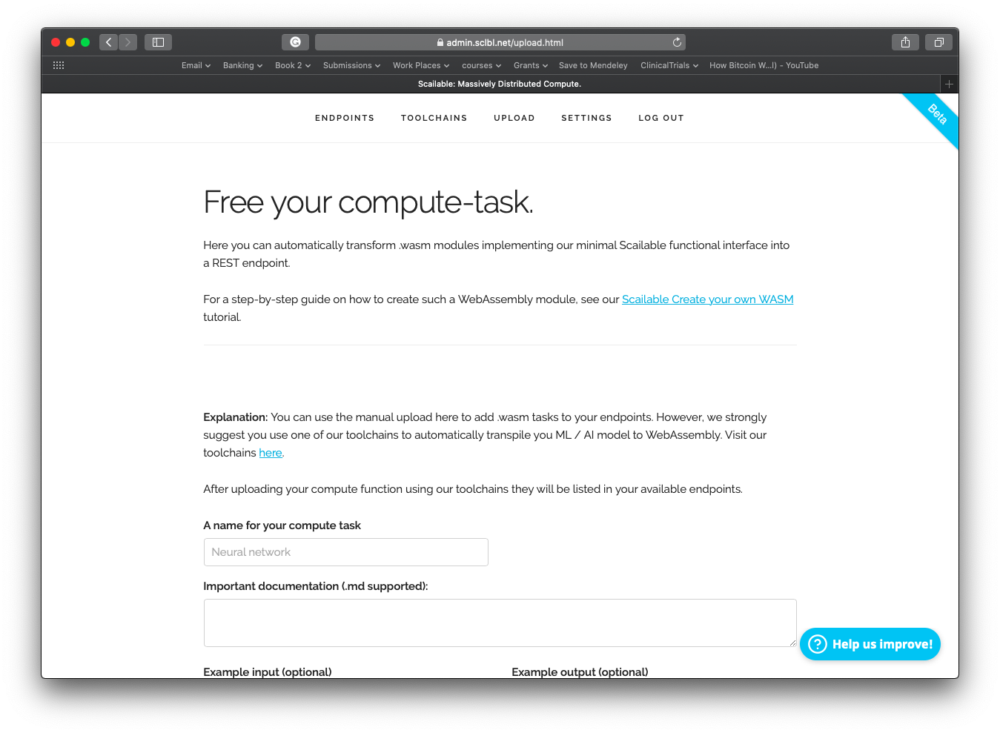

> **NOTE:** Building WebAssembly tasks from scratch can be quite tricky; we thus recommend using our packages. We focus on the `sclblpy` `python` package in the remainder of this document. However, if you want to build your own WebAssembly executable and upload it to Scailable, please check out our [Create your own WASM](https://github.com/scailable/sclbl-tutorials/tree/master/sclbl-create-your-own-wasm) tutorial.

## Settings

Finally, the Settings page located at [https://admin.sclbl.net/settings.html](https://admin.sclbl.net/settings.html) allows you to see your personal details, and an overview of your usage of our services. It looks like this:

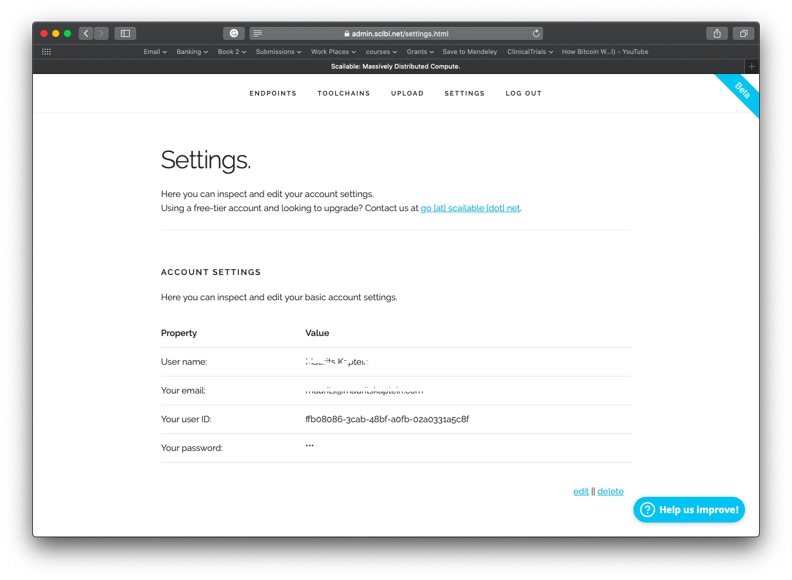

<a name="installing-sclblpy"></a>
# 3. Installing `sclblpy`

In this "101", we will explain the use of the `sclblpy` package to deploy ML / AI models directly from `python`. The `sclblpy` package, and its documentation, can all be found at [pypi](https://pypi.org/project/sclblpy/) and the package is thus easily installed using pip:

```
$ pip install sclblpy
```
(or well, `pip3` depending on your installation. `sclblpy` is a `python >3.7` package).

That's it. 

For completeness, on my local machine, using the OSX terminal, installing `sclblpy` looked like this:

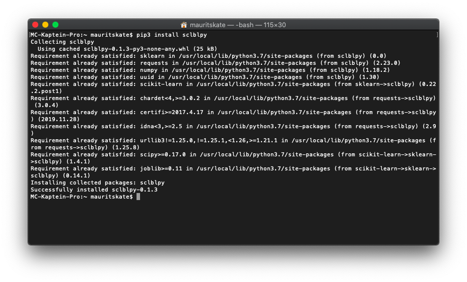

> **NOTE:** We are actively improving the `sclblpy` package, so by the time you install your version, the minor versioning number might have gone up a notch. Also, if you bump into any issues when using the package, please do report them [here](https://github.com/scailable/sclblpy/issues/new).

<a name="model-fitting"></a>
# 4. Model fitting

For demonstration purposes we fit, **and deploy**, a model that aims to predict the yearly salary of developers based on a number of characteristics such as their age, work experience, and main work tasks. We use the publicly available [Stack Overflow](https://www.stackoverflow.com) 2019 survey data as a trainings dataset. You can download it here: [https://insights.stackoverflow.com/survey](https://insights.stackoverflow.com/survey).

We created a simple [jupyter](https://jupyter.org) notebook for the data cleaning and model fitting. You can find the notebook [here](sclbl-tutorial.ipynb). We suggest you go through it step-by-step yourself, but here we will highlight the most important bits.

> **NOTE:** Effectively, feature engineering and model fitting is not really what Scailable helps you do, we focus on taking care of the deployment of a model once it has been fitted. Hence, the remainder of this section is merely illustrative. Want to skip to deployment immediately? Click [here](#model-deployment).

## Opening the data
Our first step is opening the data. We got the data directly from the [StackOverflow survey](https://insights.stackoverflow.com/survey), but to make sure that this demo is self contained we also uploaded a version here to git. And, since the original dataset is too large to upload to git, we zipped it. Hence, we unzip it to the `/data` folder, and subsequently open it:


The data contains 88883 rows, and 85 columns. We refer to the descriptions on [Stack Overflow](https://insights.stackoverflow.com/survey) for a good overview of the exact questions asked to respondents. 

## Feature engineering
The dataset contains quite a number of variables we did not think would be useful for predicting yearly salary (although these choices are pretty arbitrary, so please do revisit and make your own choices), a few NAs, and a bunch of variables that are not directly suited for ML / AI models as they are not numeric. Hence, in the [notebook](sclbl-tutorial.ipynb), we spend quite some lines on feature engineering. For example, we subset the main target variable `ConvertedComp` to not include NAs and we remove some extreme values:


We also clean up and where necessary recode the following variables:

* `OpenSourcer`, whether or not a developer contributes to open source projects,
* `Employment`, the current employment status,
* `EdLevel`, the educational level of the developer,
* `OrgSize`, the current organization size,
* `DevType`, the type of developer (e.g., a data scientist, or a database engineer),
* `YearsCode`, the number of years coding experience,
* `YearsCodePro`, the number of years professional coding,
* `MgrWant`, whether or not the developer aspires to become a manager,
* `LanguageWorkedWith`, which languages the developer works with, we pick out `[R]` and `python` explicitly,
* `Age`, the age of the developer,
* `Gender`, the gender of the developer.

Cleaning takes a bit of munching for each of the above. For example, for `Employment`, we recode and create some dummy variables using `pandas`:


Have a look around the [notebook](sclbl-tutorial.ipynb) to see all the feature engineering.

## Finalizing the data
After we are done with feature engineering we effectively subset the dataset to only retain the variables we are interested in, and we save a snapshot:


We end up with a dataset containing 51730 valid rows, and 21 features. You can find this cleaned dataset [here](data/salary_survey.csv). The features are:

1. `f_open`: Dummy indicating frequent contributions to open-source projects.
2. `f_employed`: Indicator whether the respondent is employed.
3. `f_selfemployed`: Indicator whether the respondent is self-employed.
4. `f_unemployed`: Indicator whether the respondent is unemployed.
5. `f_education`: Education level, `0=low`, `2=high`.
6. `f_organization`: Indicator whether the respondent works in a large `>500` organization.
7. `f_datascientist`: Indicator whether the respondent identifies as Data Scientists. 
8. `f_designer`: Indicator whether the respondent identifies as Designer.
9. `f_developer`: Indicator whether the respondent identifies as Developer. 
10. `f_devops`: Indicator whether the respondent identifies as DevOps Engineer. 
11. `f_engineer`: Indicator whether the respondent identifies as Engineer. 
12. `f_scientist`: Indicator whether the respondent identifies as Scientists. 
13. `f_years`: Number of years coding experience.
14. `f_yearspro`: Number of years professional coding experience. 
15. `f_ambition`: Indicator signaling ambition to become a manager. 
16. `f_python`: Indicator uses `python`.
17. `f_r`: Indicator uses `[R]`.
18. `f_age`: Age of the respondent.
19. `f_female`: Indicator `female`. 
20. `f_male`: Indicator `male`.
21. `f_other`: Indicator `other`.

## Model fitting and evaluation
And now, we are finally over to some more interesting stuff; we can start building a model to predict the developers salary based on the available features. We tried a few things, for example, we tried fitting the [elastic net](https://web.stanford.edu/~hastie/Papers/elasticnet.pdf) available in `sklearn` which often works well out-of-the-box:


As you can see however, the out-of-the-box performance in this specific case is pretty poor, with a score of only 0.044. That's too bad even for our demonstration purposes. Let's see if `xgboost` fares better:


By all means not great, but definitely better. The score is now 0.17. We will move over to deploying this model, although clearly there is room for improvement!

<a name="model-deployment"></a>
# 5. Deploying the model

Yay! It took some work, but now we arrive at the really cool stuff! We are going to deploy the `xgboost` model that we just fit. Since you should already have a Scailable account by now, the deployment process is superbly simple. First, if you haven't done so already you need to install the `sclblpy` package (we present the actual code instead of screenshots to make copy-pasting a bit easier):

```python
$ pip3 install sclblpy
```

Next, you should create an example feature vector by simply selecting the first row of our training data. This will allow `sclblpy` to check your model fitting:

```python
fv = X[0, :]
```
Subsequently, you can create the documentation for this model. We create a documentation object using the following code:

```python
with open('salary-model-docs.md', 'r') as myfile:
  docbody = myfile.read()

docs = {}
docs['name'] = "DEMO :: Salary example model"
docs['documentation'] = docbody
```
Note that in this case we actually get our documentation for this endpoint from an external markdown file. You can view the documentation markdown [here](salary-model-docs.md).

And now, we are ready to use the `sclblpy` package to deploy the model:

```python
import sclblpy as sp
sp.upload(mod2, fv, docs=docs)
```
Which, after prompting for your username and password, provides the following response:

```
> Please provide your username: *******@scailable.net
> Please type your password: ········
> Would you like us to store your user credentials (y/n)? y
> Your model was successfully uploaded. 

```

And again, you [wait](https://www.youtube.com/watch?v=9JVNMmsN3Co). Although, this time it likely takes less than a few minutes... 

In a [notebook](sclbl-tutorial.ipynb) the core of it all looks like this:


We figured it would not get much easier.

> **NOTE:** For more examples using the `sclblpy` package please read the docs at [https://github.com/scailable/sclblpy](https://github.com/scailable/sclblpy).

<a name="confirmation-email"></a>
## Confirmation email
So, we have now uploaded our first model to [Scailable](https://www.scailable.net). After running `sp.upload()` the fitted model is actually send to our servers where we parse the model, convert it to [WebAssembly](#wasm) such that it is super fast and portable, and we open up a REST endpoint. This takes a bit of time as we go through a bunch of automatic tests in the process, but once its done you will receive a mail like this:

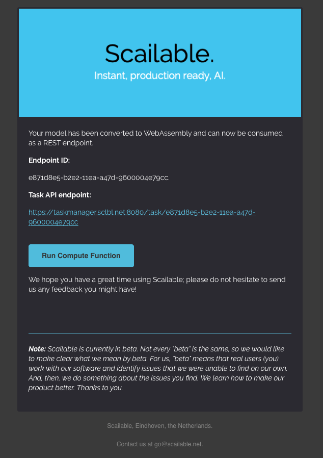

Clicking the shiny blue button takes us directly to an example webpage where we can test the endpoint. This is already pretty cool:


and tells us that this 28 year old developer with 3 years of coding experience could, according to our `xgboost` model, makes about 71500 USD a year. You can give it a spin yourself [here](https://admin.sclbl.net/run.html?cfid=45017963-8536-11ea-9efc-9600004e79cc&exin=%5B%5B0.0,%201.0,%200.0,%200.0,%201.0,%200.0,%200.0,%201.0,%201.0,%200.0,%200.0,%200.0,%203.0,%201.0,%200.0,%200.0,%200.0,%2028.0,%200.0,%201.0,%200.0%5D%5D).

To finalize our salary prediction model deployment we will create a small web-app that allows users to interactively generate inferences. We cover this last step [below](#app). However, we now first take look at what happens under the hood and we will use the Scailable web admin to inspect our created model.

## What happens under the hood?

Running `sp.upload(mod2, fv, docs=docs)` was super simple, but what actually happened? Effectively, the following happened:

1. On the client side, `sclblpy` has ran a number of checks on your fitted model, for example to see if the model is indeed fitted and if the example feature vector indeed produces a valid inference. 
2. From the client to our server, we subsequently checked the user credentials. The first time you are using `sclblpy` you are asked to provide your Scailable login credentials to make sure we associate your model with the right account.
3. Next, the fitted `python` model arrives at our *toolchain server*. This is where some magics happens. The toolchain server effectively:
	- unpacks the model package,
	- runs a bunch of additional tests,
	- *Transpiles* your model to [WebAssembly](https://webassembly.org),
	- runs more tests
	- uploads the model to your account,
	- and finally opens up a REST endpoint where you can consume your model.
4. When all this has finished, we will send you a confirmation email to indicate that you are good to go! 

So, although you might receive your endpoint confirmation email within minutes, a lot has actually happened under the hood.

> **NOTE:** You can learn more about WebAssembly and how we use it by checking our [create your own WASM](https://github.com/scailable/sclbl-tutorials/tree/master/sclbl-create-your-own-wasm) tutorial.

<a name="wasm"></a>
### A note on WASM

We understand that step 3 in the above process might be a bit unfamiliar to most readers. Why do we "transpile to WebAssembly" (or shorthand *WASM*)? Well, because by transpiling to WebAssembly we make your model magnitudes smaller, and magnitudes faster. This allows us to run you model extremely efficiently on our machines, such that the REST endpoints we open up for you are **truly production ready**. Read more about WebAssembly [here](https://webassembly.org).

Interestingly, the transpiling gives you more cool things pretty much for free: you can now download the resulting WASM binary from Scailable, and use it to run the model you just created not just via REST, but also in browsers or on IoT devices. Effectively, transpiling to WASM liberates your ML model! Pretty cool stuff.

## Inspecting the created endpoint

After this small digression let's get back to the task at hand: let's have a look at the created endpoint. First, we go to [https://admin.sclbl.net/settings.html](https://admin.sclbl.net/settings.html) again, which now looks like this:

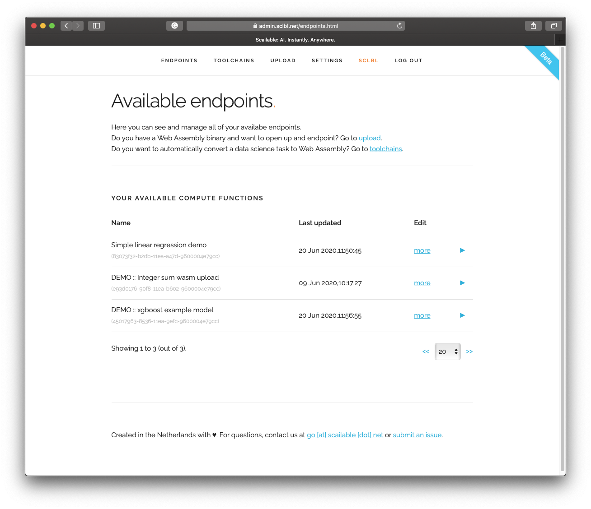

Yay, our model is listed! We can expand it and look at the documentation we provided:

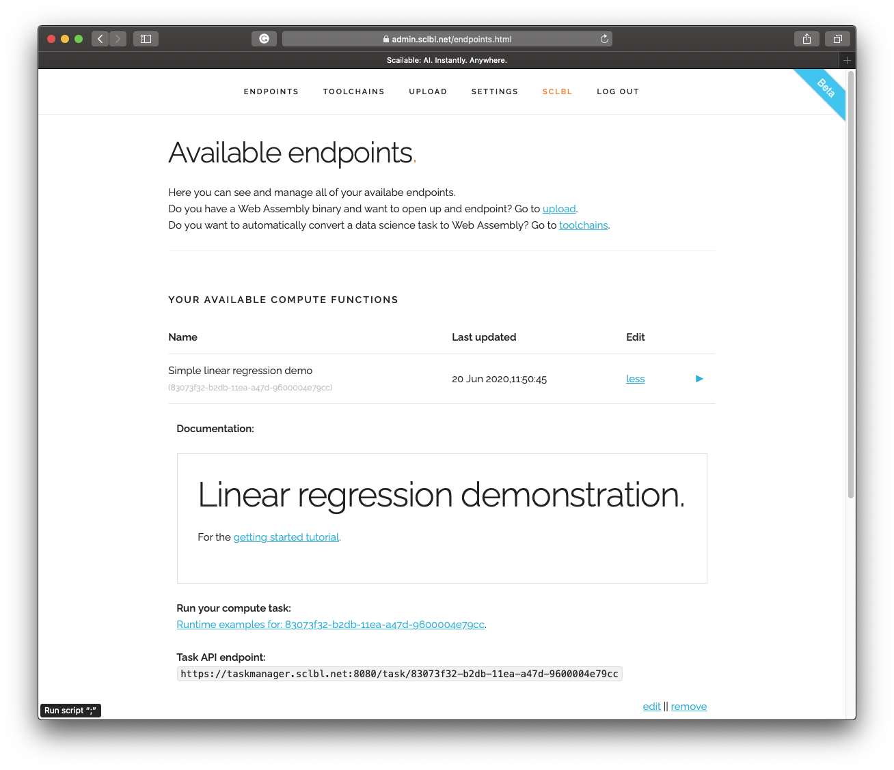

At the bottom of the docs, we see this:


And yes, we can click on the [Example task: 45017963-8536-11ea-9efc-9600004e79cc.](https://admin.sclbl.net/run.html?cfid=45017963-8536-11ea-9efc-9600004e79cc&exin=%5B%5B0.0,%201.0,%200.0,%200.0,%201.0,%200.0,%200.0,%201.0,%201.0,%200.0,%200.0,%200.0,%203.0,%201.0,%200.0,%200.0,%200.0,%2028.0,%200.0,%201.0,%200.0%5D%5D) link to get to:

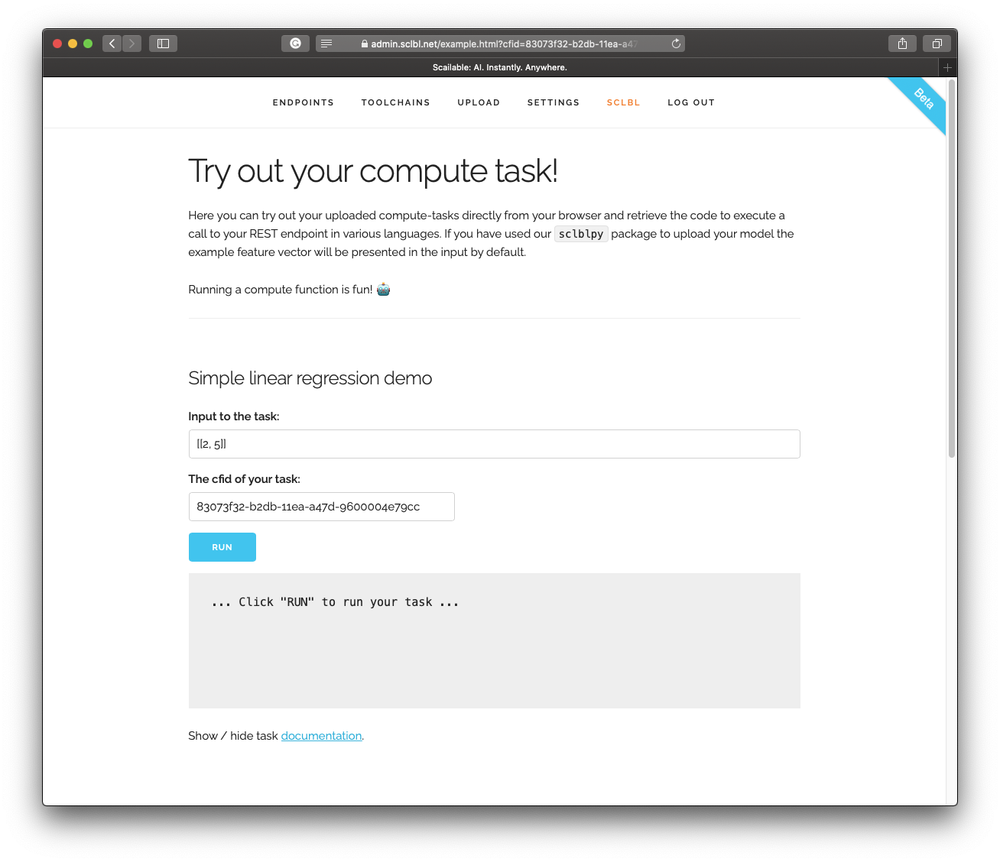

And, **this is super cool**, we can now again test our model by simply pressing RUN:

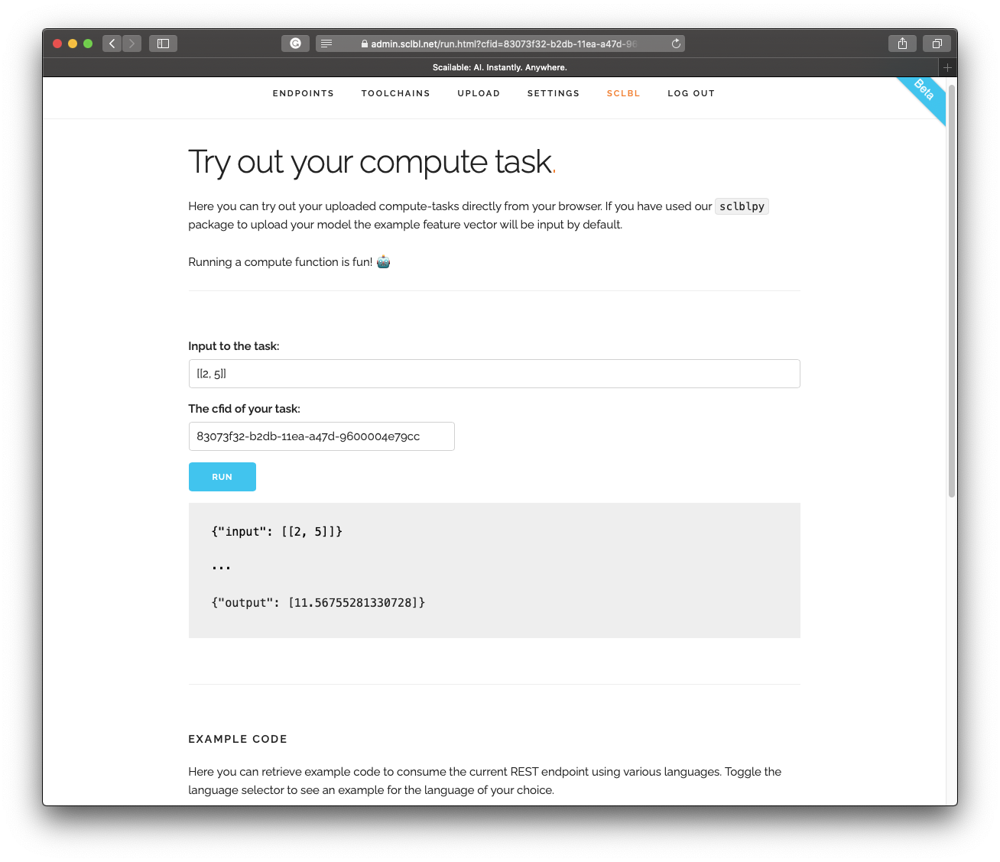

> **NOTE:** The links provided to the try out page in this document are to our "open" try out; for the standard try out of a task you will need to log in using your credentials.

## Integrating an endpoint in your app
In the next section we will show how to create a simple html/javascript front-end for the model we developed in this tutorial. However, you might want to consume your created endpoint using some other language. Conveniently, at the bottom of the example page, you can find the code to consume the endpoint in various languages:

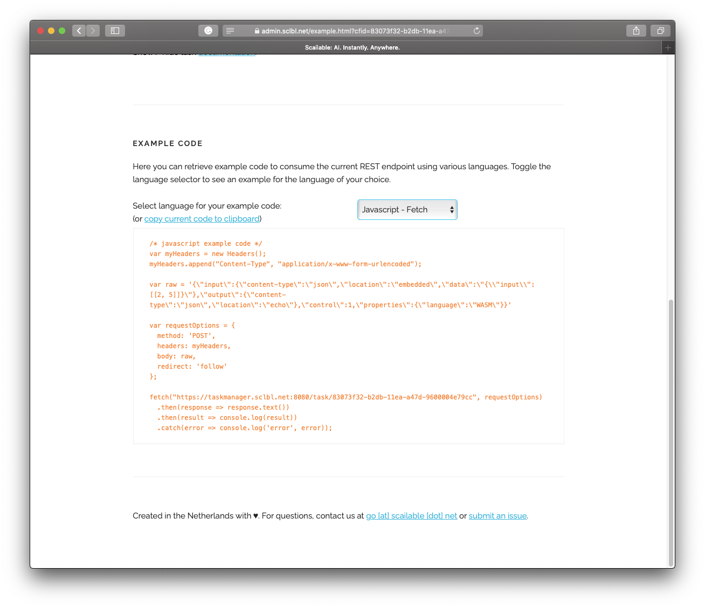

After clicking the "copy current code to clipboard" we can easily consume the endpoint using various tools. For example using `cURL`:

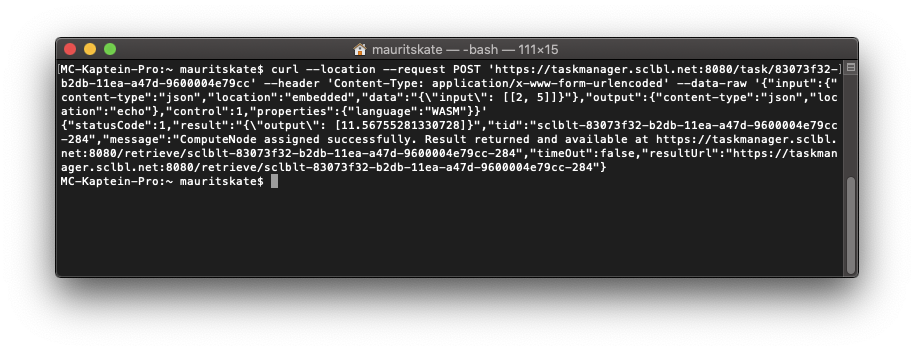

> **NOTE:** The response when executing a task is a `json` string that contains multile fields. The `result` field will contain the requested inference, while the `statusCode` can be used to check whether the task was executed successfully. If `statusCode == 1` the result will be in the `result` field. If `statusCode == 0` an error occured, while if `statusCode == 5` the task takes to long to return directly, and the result can be downloaded at `resultURL` when its done.

## Using the endpoint directly from python

On the example page in the user-admin you can directly copy-past the `python` code to consume you endpoint:


However, you can also consume an endpoint using the `sclblpy` package. As long as you have `sclblpy` installed, you can run the following code:

```python
from sclblpy import run

cfid = "e93d0176-90f8-11ea-b602-9600004e79cc"  
fv = [1,2,3,4,5]
result = run(cfid, fv)

print(result) 
```
(where you would obviously change the `cfid` and the `fv` to match your uploaded model.

You can find the documentation for `sclblpy` [here](https://pypi.org/project/sclblpy/).


<a name="app"></a>
# 6. A simple web-app

So, effectively the steps above show the main functionality of Scailable, but in any reasonable application you would probably like a nice user interface to the model (or otherwise include it in your own application). So, we created a simple HTML / JS based UI for the whole thing (click the video to play):

[](https://www.youtube.com/watch?v=KhnxhfJAc3g "Web application UI video.")

You can try the app yourself at [www.scailable.net/demo/salary](https://www.scailable.net/demo/salary), and see the source [here](https://github.com/scailable/sclbl-tutorials/tree/master/sclbl-101-getting-started/app).


----------


Thanks for your attention! Let us know if you have any questions by pressing the "Help us improve" button at [https://admin.sclbl.net](https://admin.sclbl.net) or emailing us at [go at scailable dot net](mailto:go@scailable.net).

If you find any mistakes in our tutorials, please do [add an issue](https://github.com/scailable/sclbl-tutorials/issues/new) so we can fix it asap!


